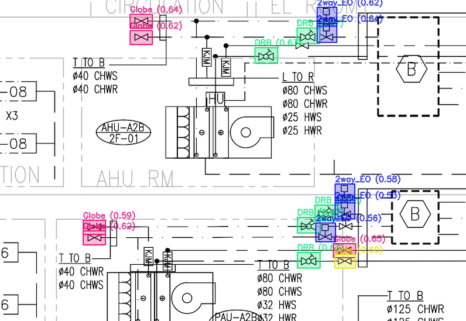
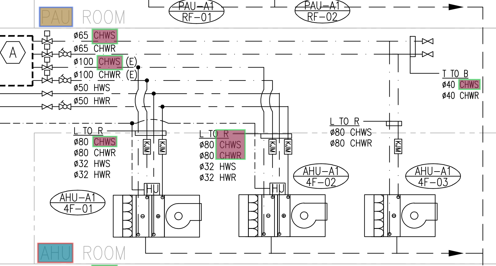

# CAD Matching Toolkit

This repository provides a comprehensive toolkit for CAD pattern detection and text matching in engineering documents.


## Features

### Pattern Matching
- Detects CAD patterns in engineering diagrams and drawings
- Multi-template matching with scale and rotation invariance
- Optimized for detecting closely placed patterns
- Semi-transparent highlighting with unique colors for each pattern
- Supports concurrent processing on multi-core systems

### Text Recognition
- OCR processing for text extraction from PDF documents
- String matching capability for finding specific text
- Adds OCR layer to PDFs for improved searchability
- Generates detailed reports of finding

## Installation

Clone the repository and install the required dependencies:

```bash
git clone https://github.com/username/CAD_matching.git
cd CAD_matching
pip install -r requirements.txt
```


## Usage

1. Pattern Matching

```bash
cd CAD_matching
python Pattern_match/pattern_detect.py -i Pattern_match/input_CAD -t Pattern_match/input_target -o Pattern_match/output_CAD
```




### Options:
-i, --image: Input image file or directory (default: Pattern_match/input_CAD)
-t, --templates: Directory containing template images (default: Pattern_match/input_target)
-o, --output: Directory to save results (default: Pattern_match/output_CAD)
--threshold: Matching threshold (0-1), higher values mean stricter matching (default: 0.53)
--workers: Number of worker threads for parallel processing (default: 4)
--overlap: Maximum allowed overlap between matches (default: 0.3)
--alpha: Transparency level for pattern highlighting (default: 0.3)


2. Text Recognition

```bash
cd CAD_matching

python String_match/main_text_det.py
```

- Use --workers parameter matching your CPU core count for optimal performance
- Adjust --threshold between 0.5-0.7 for best detection accuracy
- For detecting closely placed patterns, use lower --overlap values (0.2-0.3)
- Process large batches of files overnight using cron or task scheduler





## Output

- Visual output with highlighted patterns in output directory
- CSV report (valve_reports.csv) showing pattern counts for each file
- Text report summarizing detection statistics


